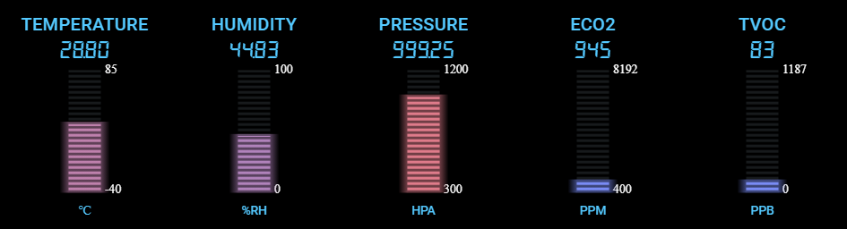
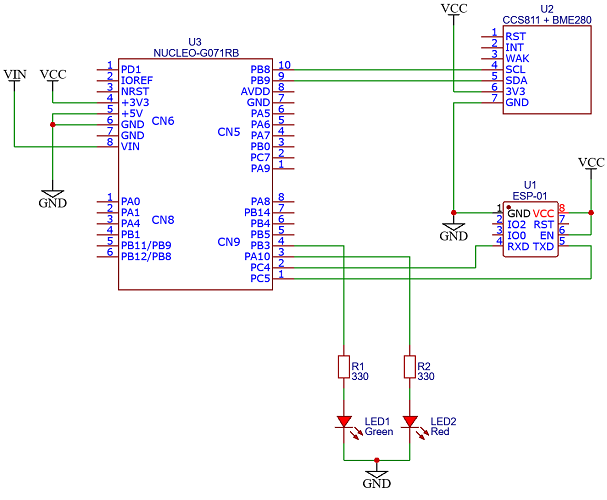
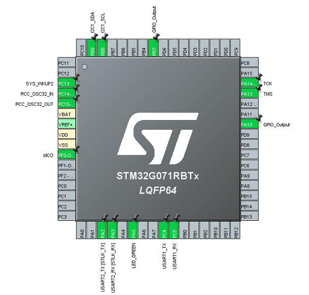

# Weaver

Indoor air quality monitor

## Components used
- [NUCLEO-G071RB](https://www.st.com/en/evaluation-tools/nucleo-g071rb.html)
- BME280 humidity sensor
- CCS811 digital gas sensor
- ESP-01 WiFi module
- Bicolor led red & green

## Schematic

## Microcontroller pinout configuration

## Firmware

The firmware can be compiled using GCC-ARM toolchain with the makefile provided or using the STM32Cube IDE.

## GUI configuration tool

The GUI tool requires Qt and QtSerialPort library
